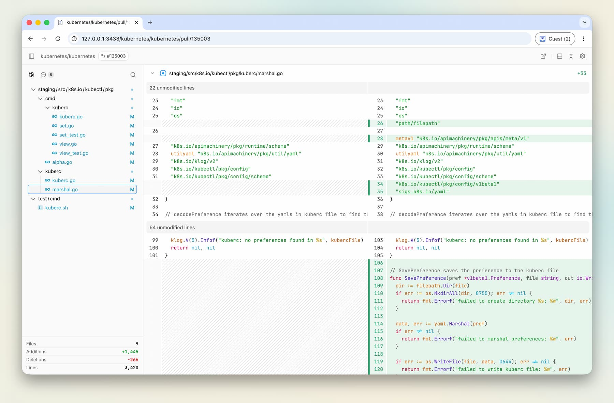

# diffs

[](https://github.com/imfing/diffs-cli/actions/workflows/ci.yml)
[](https://github.com/imfing/diffs-cli/actions/workflows/release.yml)

A tiny CLI for fast, beautiful local-first diffs in the browser.



## Motivation

`diffs` is a local-first CLI in a single binary. Inspired by [DiffsHub](https://diffshub.com) from [pierre.computer](https://pierre.computer/), it brings a calmer review experience to your working tree and GitHub pull request.

## Features

- Offline, local-first review in a single binary.
- Fast local diff viewer with file watching and browser reloads.
- GitHub pull request review and comment.

## Quick start

Download a pre-built binary from the [releases page](https://github.com/imfing/diffs-cli/releases), or build from source.

Install with Homebrew:

```sh
brew install --cask imfing/tap/diffs
```

Run from any git repository:

```sh
diffs
```

This opens `http://127.0.0.1:3433/local` and reloads when files change.

Review a GitHub pull request (requires the [GitHub CLI](https://cli.github.com)):

```sh
diffs pr                    # PR for the current branch
diffs pr 123                # PR in the current repo
diffs pr org/repo/pull/123  # PR in any repo
```

Review the current branch against a base locally:

```sh
diffs branch          # infers the base
diffs branch main     # explicit base
diffs branch --include-dirty  # include staged, unstaged, and untracked changes
```

Common flags:

```sh
diffs --port 4321 --dir /path/to/repo
diffs pr https://ghe.example.com/org/repo/pull/123
GH_HOST=ghe.example.com diffs pr org/repo/pull/123
diffs pr --gh-host ghe.example.com org/repo/pull/123
```

### Large pull requests

The `pr` command fetches the diff via `gh api`, which GitHub caps at 300 changed files. For larger PRs, clone the repo and review with `diffs` after checking out the PR branch:

```sh
gh pr checkout 123
diffs
```

## Configuration

Optional. `diffs` reads `~/.config/diffs/config.toml` on startup:

```toml
[ui]
color_scheme = "system"    # system, light, dark
diff_theme = "github"      # github, dark-plus, light-plus, one-dark-pro, ...
diff_style = "split"       # split, unified
ui_font_family = "Aptos"   # preferred UI font stack
code_font_family = "Menlo" # preferred code font stack
word_wrap = false
line_numbers = true
line_backgrounds = true
```

The file sets initial defaults only. Once you change a setting in the UI it is saved to the browser's `localStorage` and takes precedence over `config.toml` on subsequent loads.

## Comments

<details>
<summary>Experimental local comments workflow</summary>

Experimental local comments support lets a human leave review notes for an agent through the CLI. Comments are stored at `.diffs/comments.json` in the target repository; keep `.diffs/` ignored so the notes stay local.

```sh
diffs comments add --file web/src/App.tsx --line 42 --body "Check this"
diffs comments list
```

Use `reply`, `resolve`, and `reopen` to update a thread. Pass `--dir /path/to/repo` to target a different repository.

</details>

## Build from source

Requires Rust (current stable, 1.96+) and pnpm/Node.

```sh
pnpm install
pnpm build
```

The binary is written to `bin/diffs`.
